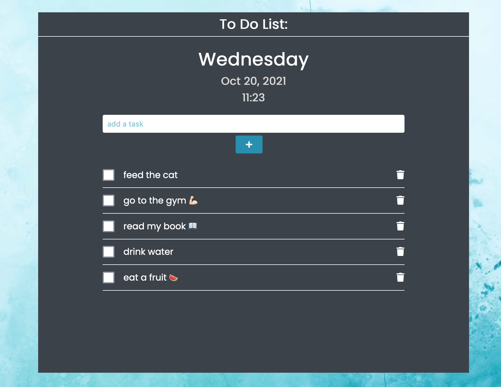

# todo-list

I created a todo-list to help me improve my coding skills. 

## Table of contents

- [Overview](#overview)
  - [Screenshot](#screenshot)
  - [Links](#links)
- [My process](#my-process)
  - [Built with](#built-with)
  - [What I learned](#what-i-learned)
- [Author](#author)


## Overview

Users should be able to:

- View the optimal layout for each page depending on their device's screen size
- See hover states for all interactive elements on the page
- Adding new item to the list
- Delete item to the list

### Screenshot




### Links

- Live Site URL: [site URL here](https://tamiriscss.github.io/todo-list/)

## My process

### Built with

- Semantic HTML5 markup
- CSS custom properties
- Flexbox
- Mobile-friendly
- Vanilla JavaScript


### What I learned

```js
let storage = window.localStorage.getItem("todos");
// console.log(storage)
let todos;
if(storage === null) {
    todos = [];
}else {
    todos = JSON.parse(storage);
}
```


## Author

- linkedin - [Tamiris Cristine](https://www.linkedin.com/in/tamiris-cristine/)
